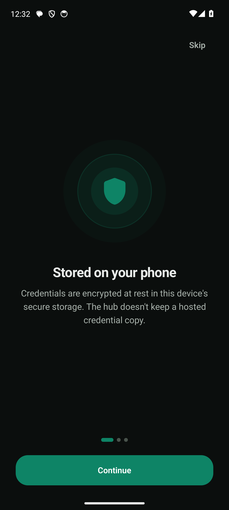
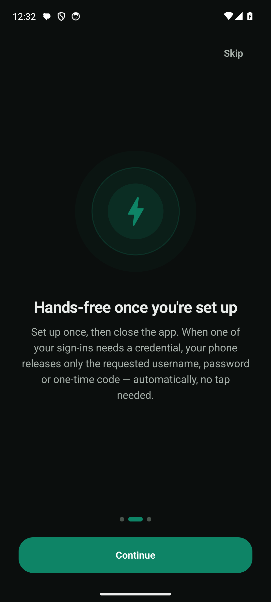
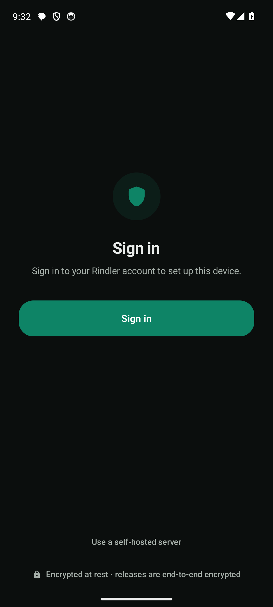
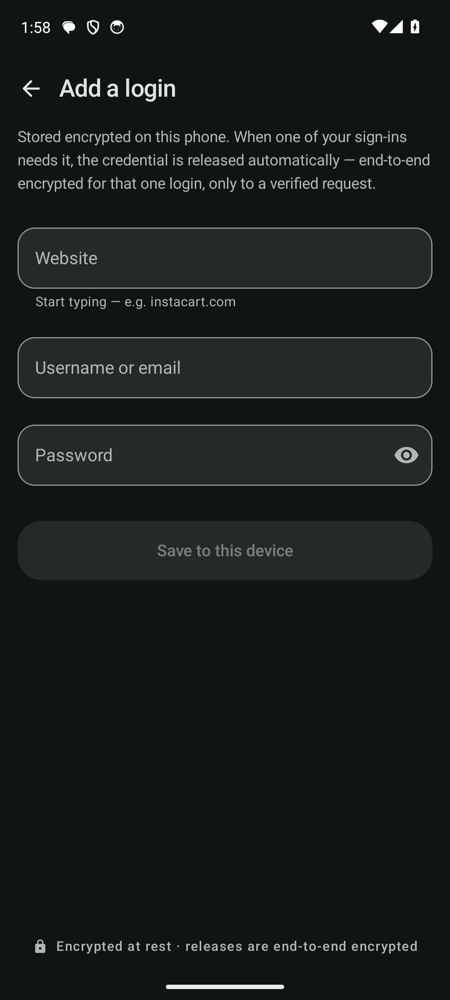
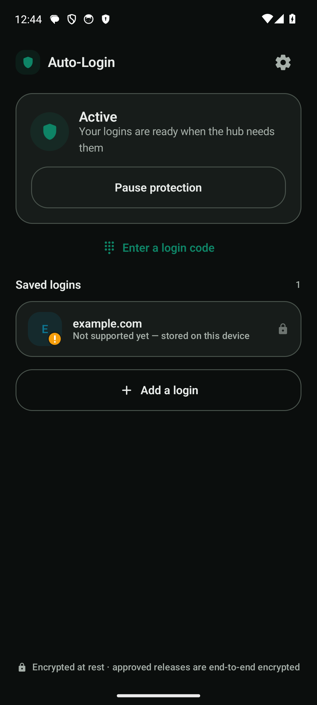
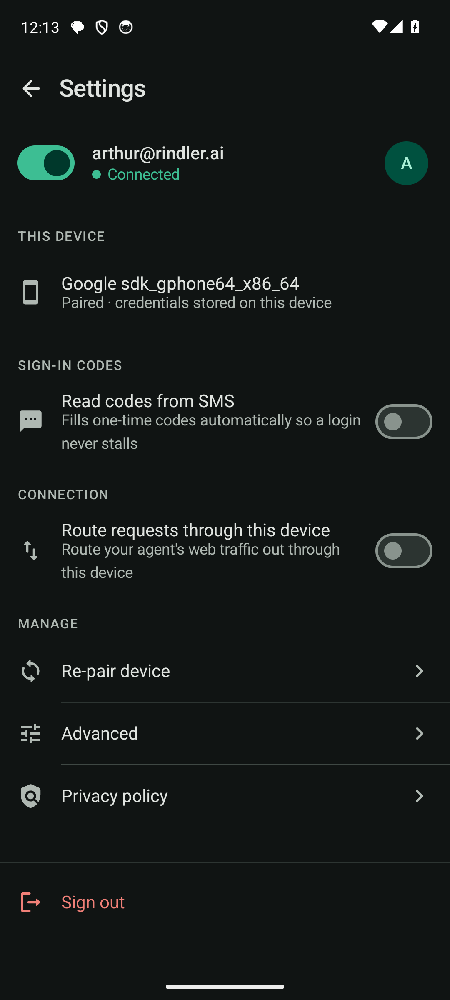

# Auto Login

[](https://github.com/rindler-ai/auto-login/releases/latest)
[](https://github.com/rindler-ai/auto-login/actions/workflows/ci.yml)
[](./LICENSE)

**Sign in to your accounts automatically, without your passwords ever leaving your phone.**

Auto Login turns your phone into a private vault for your logins. Your passwords,
two-factor codes, and email or text sign-in codes are saved only on your own device,
locked by its hardware security. When something you trust needs to sign in for you
(for example, an AI assistant doing a task on your behalf), your phone hands over just
the one thing that sign-in needs, sealed so nobody in between can read it, and then
forgets it. You set it up once, and it works hands-free after that.

**Two-factor authentication is fully supported.** When a login needs a one-time
code, Auto Login reads it on the device — from your **text messages (SMS / phone
number)** or your **email** — and relays only that code. Your phone number, mailbox,
and any authenticator (TOTP) seed never leave the phone; the device generates or
extracts the code locally and hands over just the code.

You can also let a sign-in use **your phone's own internet connection**, so the site
sees your normal home address instead of a data center. It stays off until you turn it
on with a single switch.

## 📲 Install

**[⬇️ Download the latest Android APK from Releases →](https://github.com/rindler-ai/auto-login/releases/latest)**

Open the downloaded `.apk` on your Android device to install (you grant your
browser/Files app permission to install once). See
[Install warnings](./daemon/shells/android/README.md#install-warnings--a-release-signed-apk)
for what each on-device prompt means and how to avoid them. iOS/macOS build from
source on a Mac with Xcode — see [Build and run](#build-and-run) below.

## Screenshots

<table>
  <tr>
    <td align="center"><br><sub>Your secrets stay on your device</sub></td>
    <td align="center"><br><sub>Hands-free once you're set up</sub></td>
    <td align="center"><br><sub>Pair the device to your hub</sub></td>
  </tr>
  <tr>
    <td align="center"><br><sub>Add a login — stored encrypted on-device</sub></td>
    <td align="center"><br><sub>Relay active, logins ready</sub></td>
    <td align="center"><br><sub>Manage the paired device</sub></td>
  </tr>
</table>

<sub>Captured from the Android app in an emulator with demo data — every value shown (e.g. <code>example.com</code>, <code>demo@example.com</code>) is fake; no real credentials.</sub>

**Security posture, in two lines:**

- Durable secrets are stored only on your device and never persist on any server.
  TOTP seeds and mailbox tokens never leave the device at all — the device
  generates the one-time code locally and relays only the code.
- Only a single password or a short-lived one-time code ever crosses the wire per
  login, and only inside an HPKE-sealed envelope (RFC 9180) addressed
  end-to-end to the login worker. The hub is semi-trusted and can never read a
  secret.

See [`THREAT-MODEL.md`](./THREAT-MODEL.md) for the full trust model,
[`SECURITY.md`](./SECURITY.md) for reporting vulnerabilities, and
[`PRIVACY.md`](./PRIVACY.md) for the data-handling model.

## Repository layout

| Path | What it is |
|---|---|
| `core/` | The Go client core. Packages: `protocol` (device-relay wire types + the HPKE seal), `relay` (resolve one secret, seal it, Ed25519-sign the release), `totp` (on-device RFC 6238 codes + `otpauth://` parsing), `store` (the device-local `CredentialStore` interface + an in-memory backing), `otp` (on-device email/SMS one-time-code extraction). No secret ever leaves this layer unsealed. |
| `daemon/` | The Go desktop daemon plus the gomobile bridge. `agent/` is the reusable core (hub WebSocket loop, ping to relay, replay guard, pairing); `main.go` is the desktop entrypoint; `mobile/` is the `gomobile bind` surface the native shells drive. Builds the `custody-daemon` binary. |
| `daemon/shells/` | Thin native shells over the shared Go core: `desktop/`, `android/` (Jetpack Compose), `ios/` and `macos/` (SwiftUI). Each shell owns only what Go must not touch: secure storage and per-release authorization (automatic — every shell auto-approves a verified ping, no tap or biometric). `shells/PARITY.md` records the shared-vs-divergent surface contract. |
| `contract/` | The language-agnostic wire contract (`device_relay.yaml`) plus a golden test vector (`testdata/device_relay_hpke_golden_vector.json`) proving byte-compatibility with the server. |

## How pairing and relay work

**Pairing (once per device).** The easy path is **sign-in enrollment**: tap **Sign
in** on the setup screen. The app opens your hub's `/devices/authorize` page in a
Custom Tab; you sign in with your hub account, approve the phone, and it enrolls
itself via an `autologin://paired` deep link carrying a single-use pairing token —
no code to copy. (Your hub must serve a `/devices/authorize` page that mints the
token, and the app must be built with `-PauthorizeUrl=https://<your-hub-web-origin>`.)

You can also **enter a code manually** ("Enter a code instead"):

1. Mint a single-use pairing code in your hub's device console
   (`https://your-hub.example/settings/devices`).
2. Enter the code (and your hub URL) in the app. The device generates a long-lived
   Ed25519 signing key, stored encrypted at rest under a hardware-backed keystore
   master key (it is software key material, not an enclave-resident key),
   and POSTs only its **public** key to `https://your-hub.example/devices/pair/complete`.
3. The server returns a device token and its **ping-signing public key**. The
   device verifies that key against a fingerprint bound into the pairing code
   (trust-on-first-use over the browser-to-human channel), then persists the
   token, its own key, and the server public key. The private key never leaves
   the device.

Either way, only a single-use pairing token ever crosses the browser; the device
generates and holds its own key.

**Relay (per login).**

1. The device holds one outbound `wss://` connection to
   `wss://your-hub.example/v1/devices/connect`.
2. When a login reaches a credential or OTP field, the hub sends a **signed**
   `SecretPing` naming the site, the secret kind, and the login worker's
   per-login public key.
3. The device verifies the server's signature (a substituted worker key is
   rejected outright), refuses any replayed request, then authorizes the release
   **automatically** — no per-release tap or biometric on any platform (hands-free
   by design; a verified ping is authorized by construction). The headless desktop
   binary has no relay app and declines.
4. On authorization the device resolves exactly one secret, HPKE-seals it end-to-end
   to the worker's public key, Ed25519-signs the release, and sends it. The hub
   forwards the sealed bytes but cannot open them; only the worker process can.

The device also answers a **site-inventory** query with domains only (never a
credential), so the hub can prefer the device-relay lane over a hosted browser
handoff.

## Build and run

### Desktop daemon (any OS, no extra toolchain)

```sh
cd daemon
make desktop                       # -> ./custody-daemon
RINDLER_PAIRING_CODE=<code minted at your hub's Settings -> Devices> ./custody-daemon
```

On first run it pairs, then persists the device token and key in the OS keychain
(macOS Keychain via `security`, Linux Secret Service via `secret-tool`);
subsequent runs load identity from the keychain. The headless binary has **no
approval surface, so it declines every secret request** — use a native shell for
approved releases. It still serves the non-secret inventory query. `make doctor`
reports the toolchain for the mobile and Mac targets.

Run the core test suite with:

```sh
cd core && go test ./...
```

### Android

```sh
cd daemon
make android                       # gomobile bind -> shells/android/app/libs/custody.aar
cd shells/android && ./gradlew assembleDebug
#   -> app/build/outputs/apk/debug/app-debug.apk
```

`make android` needs the Android SDK + NDK (`ANDROID_HOME` / `ANDROID_NDK_HOME`)
and a JDK 17+ (`make doctor` checks). Install the APK with
`adb install -r app-debug.apk`, then in the app: **Sign in** (or "Enter a code
instead") -> **Add a login** ->
**Start relay**.

### iOS and macOS

```sh
cd daemon
make ios          # gomobile bind -> shells/ios/Custody.xcframework (device + simulator + macOS slices)
make ios-app      # unsigned .app for the iOS simulator (needs `make ios` first)
make macos-app    # unsigned macOS menu-bar .app (needs `make ios` first)
```

These require a Mac with Xcode. Signing, notarization, and store submission need
your own Apple Developer account. See the shell READMEs under `daemon/shells/ios`
and `daemon/shells/macos`.

## Hub configuration

**Auto Login ships without a real hub host. Point it at your own hub.** Every URL
in this repository uses the placeholder `your-hub.example`; replace it with the
host of the server you run.

The desktop daemon reads configuration from environment variables:

| Variable | Purpose |
|---|---|
| `RINDLER_HUB_URL` | The hub WebSocket URL, e.g. `wss://your-hub.example/v1/devices/connect`. Must be `wss://` (a loopback `ws://` is tolerated only for local dev). |
| `RINDLER_PAIRING_CODE` | The single-use pairing code, for first-run pairing. |
| `RINDLER_PAIR_URL` | Overrides the pairing endpoint (default derived from the hub URL). |
| `RINDLER_DEVICE_NAME` | A user-facing device label. |
| `RINDLER_DEVICE_TOKEN`, `RINDLER_DEVICE_KEY`, `RINDLER_SERVER_PUBKEY` | Supply a pre-provisioned identity instead of pairing (dev use; normally these come from the keychain after pairing). |

For the Android shell, set the hub at build time:
`./gradlew assembleDebug -PhubUrl=wss://your-hub.example/v1/devices/connect`. For
the iOS/macOS shell, set the hub URL in the shell's Swift source (the `hubURL`
constant in `Sources/CustodyApp.swift`, or wire it through your app's Info.plist).
In every case the hub URL must point at the **same** server that mints your
pairing codes, or pairing will fail.

## Wire contract and the golden vector

`contract/device_relay.yaml` is the language-agnostic wire contract between the
client and the hub. It is kept language-agnostic on purpose: the client's
implementation language is a reversible choice, and the server cannot tell a
desktop relay from a mobile one.

The client and server are deliberately **separate** implementations of the same
contract, so compatibility is proven rather than assumed:
`contract/testdata/device_relay_hpke_golden_vector.json` is opened by both, and
the client's HPKE seal is asserted byte-compatible with the server's. Do not edit
the golden vector to paper over a mismatch — a divergence is a real interop bug.

## License

Auto Login is licensed under the GNU Lesser General Public License v3.0
(LGPL-3.0). See [`LICENSE`](./LICENSE).
